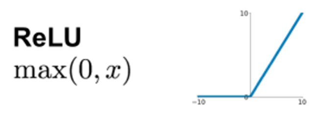
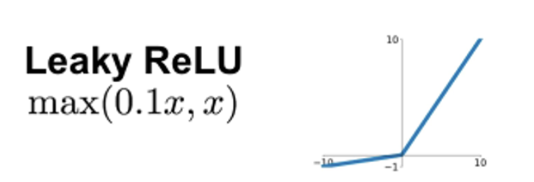
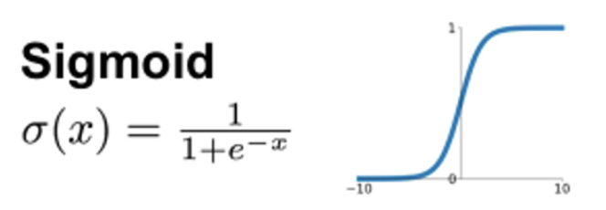
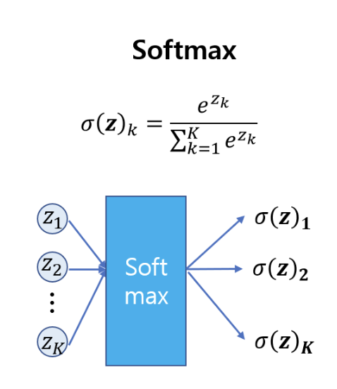

# generative-modeling
- docs: https://github.com/davidADSP/Generative_Deep_Learning_2nd_Edition
<br/><br/>

# 환경 설정 (macOS Apple Silicon)
## Python 3.11 설치
```bash
brew install python@3.11
```
## 가상환경 생성 및 활성화
```bash
/opt/homebrew/bin/python3.11 -m venv myenv
source myenv/bin/activate
```
## TensorFlow 설치
```bash
pip install tensorflow-macos
pip install tensorflow-metal  # GPU 가속용
```
## 설치 확인
```bash
python -c "import tensorflow as tf; print(tf.__version__)"
```

# 사용법
- 프로젝트 시작 시
    ```bash
    cd ~/Desktop/programs/study/ai/generative-modeling
    source myenv/bin/activate
    ```
- 종료 시
    ```bash
    deactivate
    ```
<br/><br/>

# 모델 시각화
## 모듈 설치
```bash
source myenv/bin/activate
pip install pydot graphviz
brew install graphviz
```
## 시각화 
```bash
python src/00_CIFAR10_dataset_preprocessing.py
python src/01_keras_MLP_sequential_model.py
python src/02_keras_MLP_functional_api.py
```
## 결과 확인
- 00_CIFAR10_dataset_preprocessing.png

- 01_keras_MLP_sequential_model.png

- 02_keras_MLP_functional_api.png


# 활성화 함수 종류
- 가장 대표적인 3개의 활성화 함수: 렐루, 시그모이드, 소프트맥스이다.

## 렐루(ReLU) 활성화 함수
입력이 음수이면 0이고 그 외에는 입력과 동일한 값을 출력한다.


## 리키렐루(LeakyReLU) 활성화 함수
렐루 활성화 함수는 입력이 0보다 작으면 0을 반환하지만 리키렐루 함수는 입력에 비례하는 작은 음수를 반환한다.


편향(bias)이 이미 큰 음수값이라서 렐루 함수가 항상 0을 출력한다면 이 유닛은 아무것도 학습할 수 없이 때문이다. 이 경우 그라디언트(gradient)가 0이 되어 어떤 오류도 이 유닛을 통해 전파되지 않는다.

리키렐루 활성화 함수는 그라디언트가 0이 되지 않도록 하여 이 문제를 해결할 수 있다.

이처럼 렐루 기반의 함수는 심층 신경망의 층을 안정적으로 훈련할 수 있는 믿을 만한 활성화 함수 중 하나이다.

## 시그모이드(sigmoid) 활성화 함수
층의 출력을 0에서 1사이로 조정하고 싶을 때 유용하다. ex) 출력 유닛이 하나인 이진 분류 문제나, 샘플이 하나 이상의 클래스에 속할 수 있는 다중 레이블 분류 문제에서 사용한다.


## 소프트맥스(softmax) 활성화 함수
층의 전체 출력 합이 1이 되어야 할때 사용한다. ex) 샘플이 정확히 하나의 클래스에만 속해야 하는 다중 분류 문제이다. 이 함수는 아래와 같은 수식으로 정의된다.


여기에서 K는 층에 있는 전체 유닛의 개수이다. 

앞선 01.py, 02.py 에서 소프트맥스 함수를 사용하여 마지막 층의 합이 1인 10개의 확률을 출력했었다. (src/01_keras_MLP_sequential_model.py , src/02_keras_MLP_functional_api.py)

이 값을 이미지가 10개의 클래스에 속할 확률로 이해할 수 있다.

- 이처럼 케라스에서는 활성화 함수를 층 안에 정의하거나 별도의 층으로 정의할 수 있다. 별도의 층으로 정의(Dense 층의 일부로 렐루 활성화 함수를 정의)하는 법: `x = layers.Dense(units=200, activation='relu')(x)`

# 모델 조사하기
`model.summary()` 메서드를 사용해 각 층의 크기를 조사할 수 있다. 아래와 같이 출력된다.

Model: "functional"
┏━━━━━━━━━━━━━━━━━━━━━━━━━━━━━━━━━━━━━━┳━━━━━━━━━━━━━━━━━━━━━━━━━━━━━┳━━━━━━━━━━━━━━━━━┓
┃ Layer (type)                         ┃ Output Shape                ┃         Param # ┃
┡━━━━━━━━━━━━━━━━━━━━━━━━━━━━━━━━━━━━━━╇━━━━━━━━━━━━━━━━━━━━━━━━━━━━━╇━━━━━━━━━━━━━━━━━┩
│ input_layer (InputLayer)             │ (None, 32, 32, 3)           │               0 │
├──────────────────────────────────────┼─────────────────────────────┼─────────────────┤
│ flatten (Flatten)                    │ (None, 3072)                │               0 │
├──────────────────────────────────────┼─────────────────────────────┼─────────────────┤
│ dense (Dense)                        │ (None, 200)                 │         614,600 │
├──────────────────────────────────────┼─────────────────────────────┼─────────────────┤
│ dense_1 (Dense)                      │ (None, 150)                 │          30,150 │
├──────────────────────────────────────┼─────────────────────────────┼─────────────────┤
│ dense_2 (Dense)                      │ (None, 10)                  │           1,510 │
└──────────────────────────────────────┴─────────────────────────────┴─────────────────┘
 Total params: 646,260 (2.47 MB)
 Trainable params: 646,260 (2.47 MB)
 Non-trainable params: 0 (0.00 B)

- Input 층의 크기는 x_train 의 크기와 맞아야 하고, Dense 출력 층의 크기는 y_train 의 크기와 맞아야 한다.
- 케라스는 첫 번째 차원에 None을 사용하여 아직 네트워크에 전달될 샘플의 개수를 모른다는 것을 표시하며, 실제로 샘플의 개수를 지정할 필요가 없다. 텐서 연산은 선형대수학을 사용해 동시에 모든 샘플에 수행되기 때문이다. (텐서플로우가 처리 / 심층 신경망을 CPU 대신 GPU에서 훈련할 때 훈련 성능이 증가하는 이유이기도 함)
- GPU는 텐서 곱셈에 최적화되어 있는데, 이런 계산이 복잡한 그래픽 조작에도 필요하기 때문이다.
- summary 메서드는 각 층에서 훈련될 파라미터(가중치)의 수도 알려준다.
- `모델이 너무 느리게 훈련된다면 summary 메서드를 확인해서 너무 많은 가중치가 있는 층을 확인하여, 이 층의 유닛 개수를 줄여 훈련 속도를 높일 수 있을지 검토해야 한다.`

