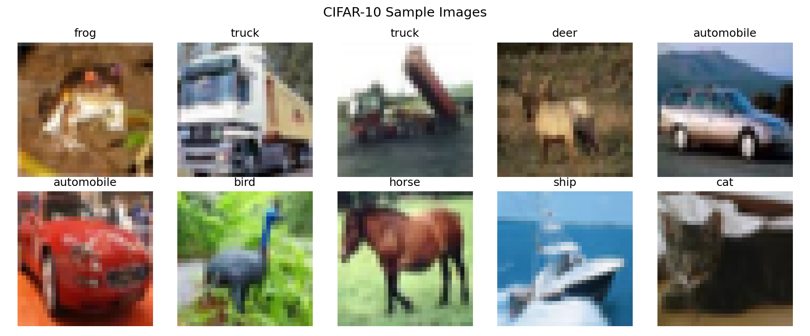
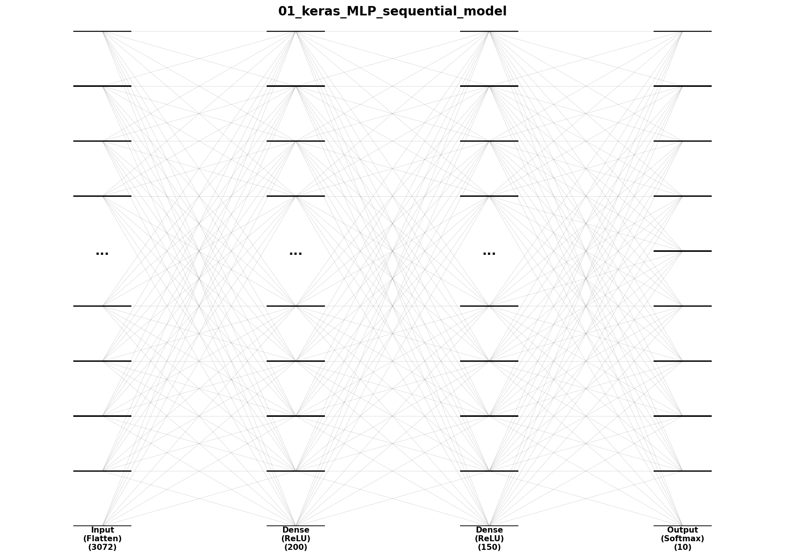
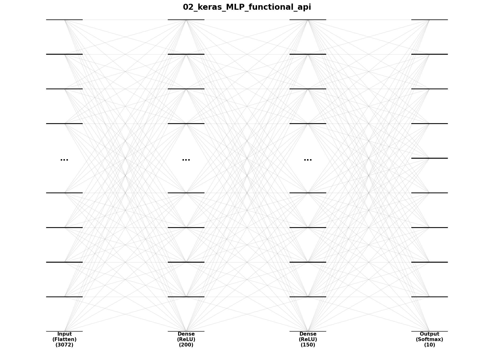

# generative-modeling
- docs: https://github.com/davidADSP/Generative_Deep_Learning_2nd_Edition
<br/><br/>

## 환경 설정 (macOS Apple Silicon)
### Python 3.11 설치
```bash
brew install python@3.11
```
### 가상환경 생성 및 활성화
```bash
/opt/homebrew/bin/python3.11 -m venv myenv
source myenv/bin/activate
```
### TensorFlow 설치
```bash
pip install tensorflow-macos
pip install tensorflow-metal  # GPU 가속용
```
### 설치 확인
```bash
python -c "import tensorflow as tf; print(tf.__version__)"
```

## 사용법
- 프로젝트 시작 시
    ```bash
    cd ~/Desktop/programs/study/ai/generative-modeling
    source myenv/bin/activate
    ```
- 종료 시
    ```bash
    deactivate
    ```
<br/><br/>

# 모델 시각화
## 모듈 설치
```bash
source myenv/bin/activate
pip install pydot graphviz
brew install graphviz
```
## 시각화 
```bash
python src/00_CIFAR10_dataset_preprocessing.py
python src/01_keras_MLP_sequential_model.py
python src/02_keras_MLP_functional_api.py
```
## 결과 확인
- 00_CIFAR10_dataset_preprocessing.png

- 01_keras_MLP_sequential_model.png

- 02_keras_MLP_functional_api.png
